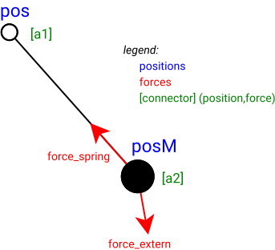

# TestChain.jl

Based on the works of Uwe Fechner [Tethers.jl](https://github.com/ufechner7/Tethers.jl).
In addition to this monolithic model, a segmented chain model is introduced.

All simulations are implemented in Julia programming language using

* [ModelingToolkit.jl](https://docs.sciml.ai/ModelingToolkit/stable/)  and
* [Modia.jl](https://modiasim.github.io/Modia.jl/stable/index.html)


Modeling assumption for the **chain**:

* Chain was divided into segments with the same length and mass
* No rotational friction between segments
* Total length of teh chain remains unchanged (no, reel in/out)


Modeling assumption for a **segment**:

* strian due to forces with a defined stiffness and damping
* segment has only one mass and no inertia
* on the connection points only forces are considered - no torques are applied on the segment
* no friction due to movement in the air




## Modeling approach

The models are reduced to make it easier to compare the results. At the beginning, a very simple approach was used (level 0). In the future, the restrictions will be removed step by step.


| level | comment |
|:----|:---|
| level **0** | a simplified model - see description above|
| level **1** | air friction considered **coming soon** |
| level **2** | ?? |


## Testcase - level 0

For testing the various models, the original parameter settings were used with a few
changes.


```julia
@with_kw mutable struct Settings3 @deftype Float64
    g_earth::Vector{Float64} = [0.0, 0.0, -9.81] # gravitational acceleration     [m/s²]
    v_wind_tether::Vector{Float64} = [2, 0.0, 0.0]
    rho = 1.225
    cd_tether = 0.958
    l0 = 50                                      # initial tether length             [m]
    v_ro = 2                                     # reel-out speed                  [m/s]
    d_tether = 4                                 # tether diameter                  [mm]
    rho_tether = 724                             # density of Dyneema            [kg/m³]
    c_spring = 614600                            # unit spring constant              [N]
    rel_compression_stiffness = 0.01             # relative compression stiffness    [-]
    damping = 473                                # unit damping constant            [Ns]
    segments::Int64 = 5                          # number of tether segments         [-]
    α0 = π/10                                    # initial tether angle            [rad]
    duration = 10                                # duration of the simulation        [s]
    save::Bool = false                           # save png files in folder video
end

```

**modification**
```
se = Settings3(; segments=5,v_ro=0.0, v_wind_tether=[0.00,0.0,0.01], rho=0.0)
```


### Modeling


The following 3 models are considered

* `Tether_07mod0.jl` - the **original (monolithic) version** using MTK ecosystem
* `SegMTKLev0.jl` - acausal model with connected segments using **MTK** ecosystem
* `SegModiaLev0.jl` - acausal model with connected segments using **Modia** ecosystem


All the simulation are producing a **HDF5** file with the position of all the nodes in the defined time range.


### Comparison of results

For comparison all the results are shown in a diagram (only the position of the last segment).


## Appendix

### Installation modeling environment

It's assumed that the `ModelingToolkit` ecosystem is already installed.

It's recommended to use the latest versions from `Modia`

> ```julia
>using Pkg
>Pkg.add("https://github.com/ModiaSim/Modia.jl.git")
>```
